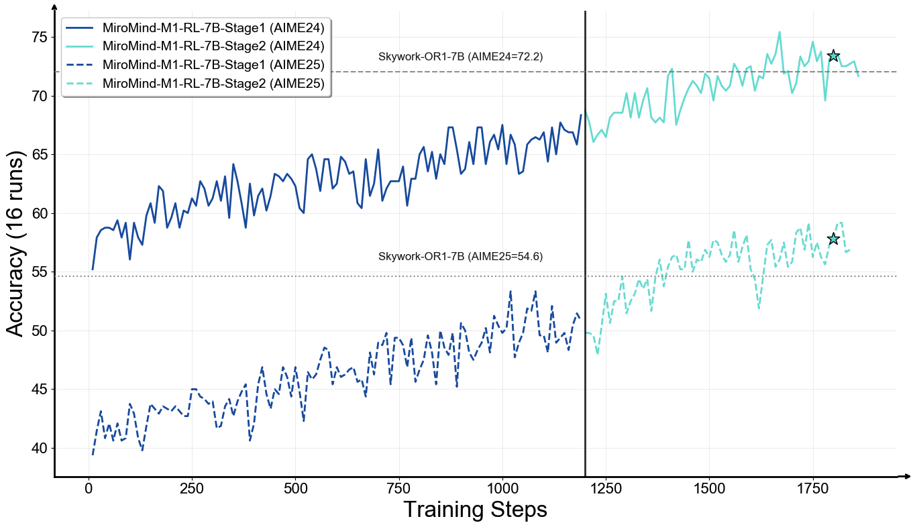

<!-- markdownlint-disable first-line-h1 -->
<!-- markdownlint-disable html -->
<!-- markdownlint-disable no-duplicate-header -->

<div align="center">
  
</div>
<!-- <hr> -->
<div align="center">

[](https://huggingface.co/miromind-ai/MiroMind-M1-RL-7B)
[](https://huggingface.co/datasets/miromind-ai/MiroMind-M1-RL-62K)
[](https://arxiv.org/abs/2507.14683)
[](https://github.com/MiroMindAsia/MiroMind-M1)
[](https://miromind.ai/)

[](https://discord.com/invite/GPqEnkzQZd)
[](https://cdn-uploads.huggingface.co/production/uploads/68525b342230a897a65cc1c0/SGK70isvVpeJwk_fny9sb.png)
[](https://www.xiaohongshu.com/user/profile/663098830000000003033edc)
</div>


# MiroMind-M1


## 🧾 Overview
<div align="center">
  
  <p><i>Training performance of MiroMind-M1-RL-7B on AIME24 and AIME25.</i></p>
</div>

**MiroMind-M1** is a fully open-source series of reasoning language models built on `Qwen-2.5`, focused on advancing mathematical reasoning. It is trained through supervised fine-tuning (**SFT**) on 719K curated problems and reinforcement learning with verifiable rewards (**RLVR**) on 62K challenging examples, using a context-aware multi-stage policy optimization method (**CAMPO**). MiroMind-M1 achieves state-of-the-art performance among open-source 7B Qwen-2.5-based models on AIME24, AIME25, and MATH500, with all models (`MiroMind-M1-SFT-7B`, `MiroMind-M1-RL-7B`, `MiroMind-M1-RL-32B`), data (`MiroMind-M1-SFT-719K`, `MiroMind-M1-RL-62K`), and training setups openly released.


## 📊 Evaluation

### MiroMind-M1-SFT
| Model           | Initial Checkpoint         | AIME24 (avg@64) | AIME25 (avg@64) | MATH500 (avg@5) |
|------------------|----------------------------|--------|--------|---------|
| DeepSeek-R1-Distill                  | Qwen2.5-Math-7B             | 55.5   | 40.4†  | 92.8    |
| OpenThoughts                         | Qwen2.5-7-Instruct           | 31.3   | 23.3   | 83.2    |
| Open-R1                              | Qwen2.5-Math-7B-Instruct     | 36.7   | 40.0   | 90.6    |
| Synthetic-1                          | Qwen2.5-7B-Instruct          | 30.0   | 26.6   | 85.6    |
| MiMo-7B-SFT                          | MiMo-7B-Base          | 58.7   | 44.3   | 93.0    |
| **MiroMind-SFT-7B**                  | Qwen2.5-Math-7B             | **60.4**   | **45.0**   | **94.6**    |

*† means that the score of DeepSeek-R1 on AIME25 is from our evaluation.*

### MiroMind-M1-RL
| Model                            | AIME24 (avg@64) | AIME25 (avg@64) | MATH500 (avg@5) |
|----------------------------------|--------|--------|---------|
| DeepSeek-R1                      | 79.8   | 70.0   | –       |
| DeepSeek-R1-0528                 | 91.4   | 87.5   | –       |
| Qwen3-8B                         | 76.0   | 67.3   | –       |
| DeepSeek-R1-0528-Qwen3-8B        | 86.0   | 76.3   | –       |
| MiMo-7B-RL                       | 68.2   | 55.4   | 95.8    |
| <tr><td colspan="4" align="center"><em>**32B Models trained from Qwen2.5 series**</em></td></tr> |
| DeepSeek-R1-Distill-Qwen-32B     | 70.8   | 52.1   | 95.8    |
| Skywork-OR1-32B-Preview          | 77.1   | **68.2**   | **97.5**    |
| **MiroMind-M1-RL-32B**           | **77.5**   | 65.6   | 96.4    |
| <tr><td colspan="4" align="center"><em>**7B Models trained from Qwen2.5 series**</em></td></tr> |
| DeepSeek-R1-Distill-Qwen-7B      | 55.5   | 39.2   | –       |
| **MiroMind-M1-SFT-7B**           | 60.4   | 45.0   | 94.6    |
| Light-R1-7B-DS                   | 59.1   | 44.3   | –       |
| Skywork-OR1-7B                   | 72.2   | 54.6   | –       |
| **MiroMind-M1-RL-7B**            | **73.4**   | **57.8**   | **96.7**    |


## 🛠 Getting Started

### Installation

venv environment:

```bash
git clone https://github.com/MiroMindAsia/MiroMind-M1.git
cd MiroMind-M1

# Install Python 3.10 environment.
python3.10 -m pip install virtualenv
virtualenv -p python3.10 venv
source venv/bin/activate

# Install dependencies.
pip3 install torch==2.6.0+cu124 --index-url https://download.pytorch.org/whl/cu124
pip3 install numpy psutil ninja packaging cmake
pip3 install flash_attn==2.7.4.post1 --no-build-isolation # This may take a while...
pip3 install vllm==0.8.5.post1
pip3 install -e .
```

## 🎨 Data Preparation

Run the below commands to generate training and validation parquet files.

```bash
python data/prepare_train_data.py --local_dir data/
python data/prepare_val_data.py --local_dir data/
```


## 🏋️ Training

### Multi-Node Training

Here is a quik guided to start Ray for multi-node training.

#### On the head node
```bash
ray stop
ray start --head --node-ip-address $HEAD_NODE_IP --num-gpus 8 --dashboard-host=0.0.0.0
```

#### On other nodes
```bash
ray stop
ray start --address="$HEAD_NODE_IP:6379" --num-gpus 8
```

### Start Training

First, please provde the below variables:

```bash
export MODEL_PATH=YOUR_MODEL_PATH
export CKPTS_DIR=YOUR_CKPTS_DIR
export TRAIN_FILE=YOUR_TRAIN_FILE
export TEST_FILE=YOUR_TEST_FILE
export HOME=YOUR_HOME_PATH
```

Then run the below script to start the training:

```bash
bash rl_train/campo_32b.sh
```

## ⚖️ Run Evaluation

We provide ready-to-use evaluation scripts in the `eval_example_script/` directory for mathematical reasoning benchmarks.

### Quick Start

```bash
# Evaluate on AIME 2024
bash eval_example_script/evaluate_7b_aime24.sh

# Evaluate on AIME 2025  
bash eval_example_script/evaluate_7b_aime25.sh

# Evaluate on Math-500
bash eval_example_script/evaluate_7b_math500.sh
```

### Supported Benchmarks

| Dataset | Script | Standard Runs |
|---------|--------|---------------|
| **AIME 2024** | `evaluate_7b_aime24.sh` | 64 runs |
| **AIME 2025** | `evaluate_7b_aime25.sh` | 64 runs |
| **Math-500** | `evaluate_7b_math500.sh` | 5 runs |

### Results

Results are saved in `results/[model_name]/[dataset_name]/` with:
- `average_accuracy.txt`: Final accuracy score
- `run[X]_inference_eval_results.csv`: Detailed results

## 📚 Citation
Please cite our technical report if you found our work helpful:
```
@article{li2025miromind,
  title={MiroMind-M1: An Open-Source Advancement in Mathematical Reasoning via Context-Aware Multi-Stage Policy Optimization},
  author={Li, Xingxuan and Xiao, Yao and Ng, Dianwen and Ye, Hai and Deng, Yue and Lin, Xiang and Wang, Bin and Mo, Zhanfeng and Zhang, Chong and Zhang, Yueyi and others},
  journal={arXiv preprint arXiv:2507.14683},
  year={2025}
}

@article{zhang2025100,
  title={100 days after deepseek-r1: A survey on replication studies and more directions for reasoning language models},
  author={Zhang, Chong and Deng, Yue and Lin, Xiang and Wang, Bin and Ng, Dianwen and Ye, Hai and Li, Xingxuan and Xiao, Yao and Mo, Zhanfeng and Zhang, Qi and others},
  journal={arXiv preprint arXiv:2505.00551},
  year={2025}
}
```

## 🙏 Acknowledgement

The RL trianing is built from the wonderful [`verl`](https://github.com/volcengine/verl) project.
